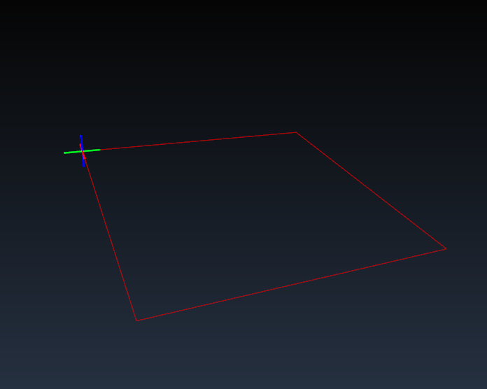
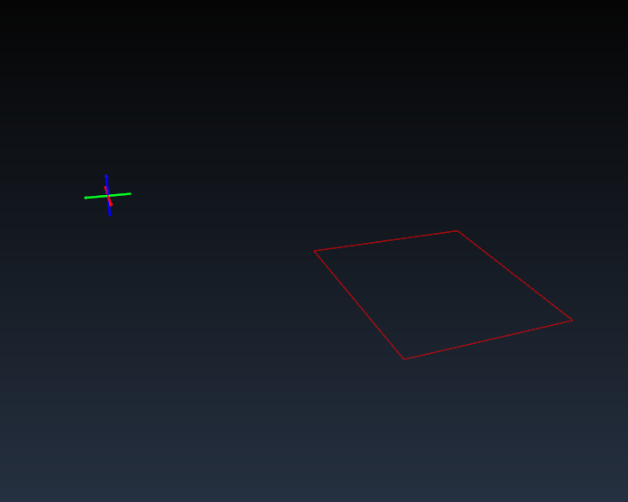
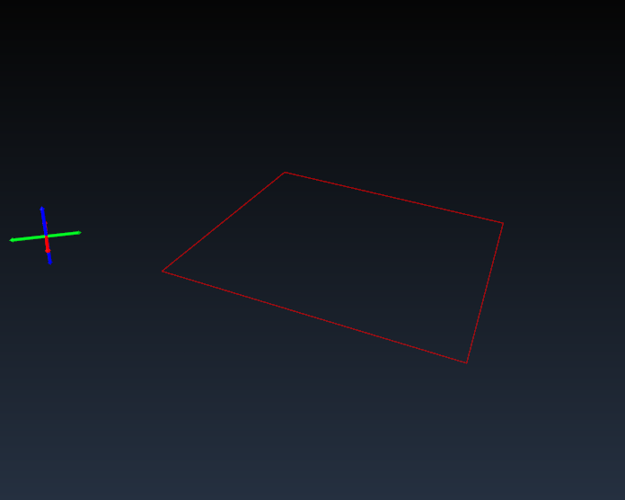
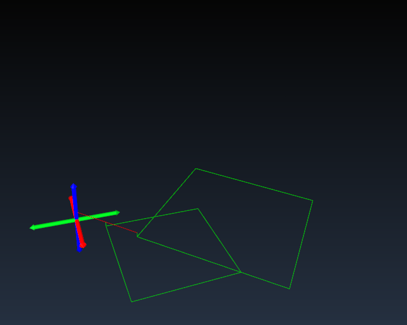
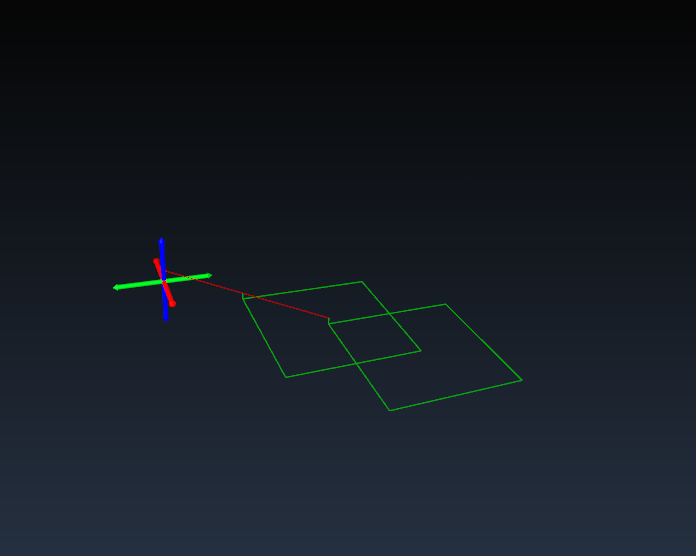

TPLang Matrices
===============

# Basic Tool Path Generation
The basic functions of TPLang generate tool paths in the form of GCode.  In
particular the functions ```rapid()``` and ```cut()``` emit rapid and cutting
moves respectively.  For example, the following program generates a movement
about a 1x1 square:

```javascript
rapid(0, 0);
rapid(1, 0);
rapid(1, 1);
rapid(0, 1);
rapid(0, 0);
```

This will produce the following GCode:

```
G21    (mm mode)
G0 X1
G0 Y1
G0 X0
G0 Y0
%      (end of program)
```


Note, that a starting position of (0, 0) is assumed and GCode only requires
writing the axes which have changed.

# Basic Matrix Operations
The most basic matrix functions are ```translate()```, ```rotate()``` and
```scale()```.  These functions can be used to apply transformations to the
tool paths output by functions like ```rapid()``` and ```cut()```.  For example,
if we take our previous program but first make a call to ```translate()```
the output is effected as follows:

```javascript
translate(1, 1);

rapid(0, 0);
rapid(1, 0);
rapid(1, 1);
rapid(0, 1);
rapid(0, 0);
```

```
G21
G0 X1 Y1
G0 X2
G0 Y2
G0 X1
G0 Y1
%
```



# Combining Matrix Operations
Now our 1x1 square has been translated to (1, 1).  We can also scale and rotate
as follows:

```javascript
scale(3, 3);
rotate(Math.PI / 4);
translate(1, 1);

rapid(0, 0);
rapid(1, 0);
rapid(1, 1);
rapid(0, 1);
rapid(0, 0);
```

This produces a 3x3 square rotated 45 degrees and translated to (1, 1).

```
G21
G0 X1 Y1
G0 X3.12132 Y3.12132
G0 X1 Y5.242641
G0 X-1.12132 Y3.12132
G0 X1 Y1
%
```


Matrix operations accumulate via matrix multiplication.  The default matrix is
the identity matrix which does not change the tool path output at all.  To get
back to the identity matrix we can call ```loadIdentity()``.  With this ability
we can create square function and apply different matrix transformations to it.
Of course it's not very interesting to do just rapid moves so let's try some
cutting moves connected by a rapid.

```javascript
function square(depth, safe) {
  rapid({z: safe});
  rapid(0, 0);

  cut({z: depth});

  cut(1, 0);
  cut(1, 1);
  cut(0, 1);
  cut(0, 0);

  rapid({z: safe});
}

feed(400);

scale(3, 3);
rotate(Math.PI / 4);
translate(1, 1);
square(-1, 2);

loadIdentity();
scale(2, 2);
translate(0.5, 0.5);
square(-1, 2);
```




# Order of Matrix Operations
Matrix operations are combined through matrix multiplication.  TPLang takes
care of the details but it is important to note that unlike the multiplicate of
real numbers order matters when it comes to matrx multiplication.  Scaling then
translating is not the same as applying the same operations in the reverse
order.

```javascript
scale(2, 2);
translate(1, 1);
square(zcut, zsafe);

loadIdentity();
translate(1, 1);
scale(2, 2);
square(zcut, zsafe);

```



Note that for the second square the starting position of the square (1, 1)
is scaled up to (2, 2) because the translation is applied before the scale
operation.  The first square begins at (1, 1) as expected.

# Matrix push and pop
It is also possible to use ```pushMatrix()``` and ```popMatrix()``` to push
and pop the current matrix to and from the matrix stack.  This can be useful
for applying temporary changes to the matrix.

```javascript
translate(1, 1);

pushMatrix();
scale(2, 2);
square(zcut, zsafe);
popMatrix();

square(zcut, zsafe);

```


